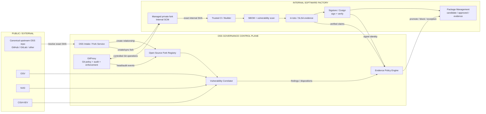
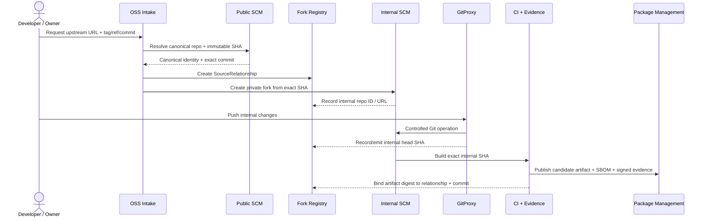
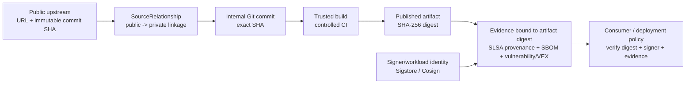
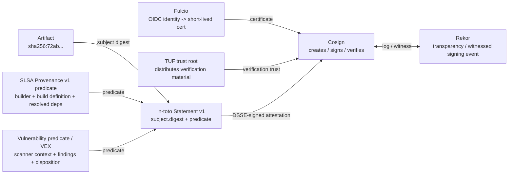
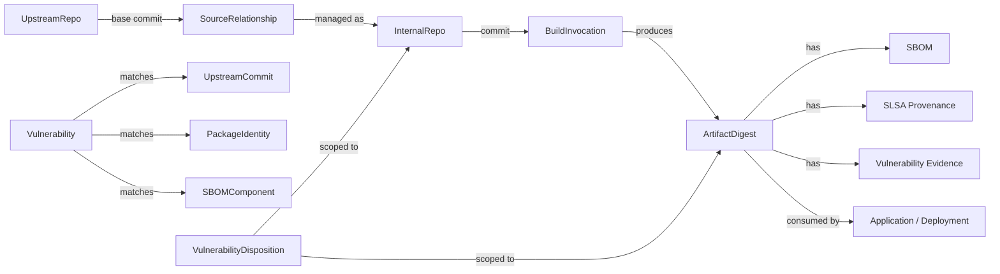
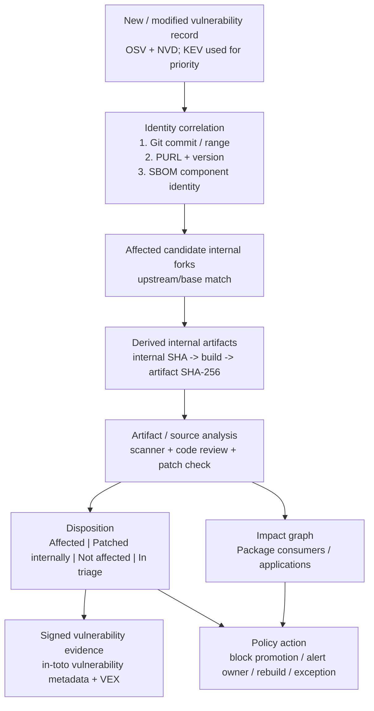

# GitProxy Internal Open Source Fork Governance

Architecture and detailed design for upstream linkage, CVE correlation, signed provenance and internal artifact publication

Draft v0.1


> **Core outcome:** Every internally published open-source-derived artifact can be traced from its SHA-256 digest back to the exact internal Git commit and the exact public upstream origin, with current vulnerability status and cryptographically verifiable evidence.

**Scope**

- Extend GitProxy from outbound contribution control into a
  bidirectional open-source governance control point.

- Maintain managed private forks of public projects without losing the
  public-to-private relationship.

- Correlate public vulnerability disclosures to internal forks, built
  artifacts and downstream consumers.

- Use in-toto/SLSA for machine-verifiable claims and Sigstore for
  signing/identity; publish artifacts and evidence through the internal
  Package Management capability.

This is an architecture proposal, not a product commitment. Exact API
names and storage schemas are illustrative.

## Contents

- [1. Executive summary](#1-executive-summary)
- [2. Goals, non-goals and design principles](#2-goals-non-goals-and-design-principles)
- [3. Current GitProxy foundation and extension boundary](#3-current-gitproxy-foundation-and-extension-boundary)
- [4. Proposed target architecture](#4-proposed-target-architecture)
- [5. End-to-end workflows](#5-end-to-end-workflows)
- [6. Component / actor responsibilities](#6-component--actor-responsibilities)
- [7. Evidence and specification model](#7-evidence-and-specification-model)
- [8. Data model](#8-data-model)
- [9. GitProxy extensions required](#9-gitproxy-extensions-required)
- [10. Vulnerability correlation and CVE lifecycle](#10-vulnerability-correlation-and-cve-lifecycle)
- [11. Build, signing and package management publication](#11-build-signing-and-package-management-publication)
- [12. Policy and control model](#12-policy-and-control-model)
- [13. Security and threat considerations](#13-security-and-threat-considerations)
- [14. Implementation plan](#14-implementation-plan)
- [15. Key design decisions and open questions](#15-key-design-decisions-and-open-questions)
- [Appendix A. Example records and attestations](#appendix-a-example-records-and-attestations)
- [Appendix B. Specifications and source references](#appendix-b-specifications-and-source-references)

> **Recommended implementation boundary:** Keep CVE ingestion, fork synchronization, build evidence and long-running analysis asynchronous. The Git push path should perform fast local/registry-backed policy checks and emit events; it should not call public vulnerability services synchronously.

## 1. Summary

GitProxy already provides a strong Git control point: it sits between
developers and Git remotes, executes a chain of processors on Git
operations, applies policy, records audit state, and supports extensions
through plugins. GitProxy v2 also removes GitHub-only assumptions and
identifies repositories by internal ID, enabling multiple forks of the
same repository and multiple Git hosts. [1][2][4]

The proposed extension adds a persistent Open Source Fork Registry and a
set of asynchronous governance services around GitProxy. GitProxy
remains the Git policy and audit layer; it does not become a monolithic
vulnerability scanner or artifact repository.



*Figure 1 - Proposed architecture: GitProxy as the Git control point
inside a broader OSS governance control plane.*

## Design in one sentence

> **Public source -> private fork -> trusted build -> signed evidence -> internal artifact.** The exact upstream commit is registered when the fork is created; the exact internal commit is recorded when code changes; the build produces an artifact digest; in-toto and vulnerability evidence bind claims to that digest; Sigstore signs the claims; the Package Management capability stores and distributes the approved bytes.

# 2. Goals, non-goals and design principles

## 2.1 Functional goals

- G1 - Preserve a durable relationship between a canonical public
  repository and one or more managed internal forks.

- G2 - Capture immutable upstream origin: canonical repository identity,
  selected tag/ref, and exact Git commit SHA at fork/sync time.

- G3 - Trace each internally published binary/package back to the exact
  internal Git commit and source relationship that produced it.

- G4 - Detect public vulnerabilities that may affect a registered
  upstream source, internal fork, built artifact or SBOM component.

- G5 - Support an explicit disposition for internal patches: affected,
  patched internally/resolved, not affected, false positive or in
  triage.

- G6 - Produce portable machine-verifiable provenance/security evidence
  using open specifications.

- G7 - Cryptographically bind evidence to artifacts and to approved
  signer/workload identities.

- G8 - Enforce promotion/consumption policies before artifacts enter
  approved package repositories.

- G9 - Preserve an auditable history of fork creation, upstream syncs,
  internal modifications, builds, scans, approvals and exceptions.

- G10 - Work across Git hosts and allow multiple internal forks of the
  same upstream project.

### 2.2 Non-goals

- GitProxy should not replace vulnerability platforms. It
  should integrate with one or more scanners and feeds.


## 2.3 Design principles

| **Principle**                        | **Design consequence**                                                                                            |
|--------------------------------------|-------------------------------------------------------------------------------------------------------------------|
| Digest first                         | Artifacts are identified by cryptographic digest, not filename or version label.                                  |
| Exact source identity                | Store immutable Git SHAs and canonical repository identity; tags are descriptive metadata.                        |
| Evidence is append-only              | New scans/dispositions create new evidence rather than rewriting historic evidence.                               |
| Fail closed at promotion             | Missing or unverifiable mandatory evidence prevents promotion into an approved repository.                        |
| Async intelligence, sync enforcement | Feeds and analysis run asynchronously; enforcement reads a current internal decision state.                       |
| Separation of concerns               | GitProxy controls Git; CI builds; vulnerability services analyze; Sigstore signs; Package Management stores/distributes. |
| Open formats first                   | Use in-toto/SLSA, CycloneDX and Sigstore-compatible bundles to reduce proprietary coupling.                       |

## 3. Current GitProxy foundation and extension boundary

### 3.1 Existing capabilities to reuse

| **Existing GitProxy capability**          | **How the design uses it**                                                                                           |
|-------------------------------------------|----------------------------------------------------------------------------------------------------------------------|
| HTTP/HTTPS/SSH Git proxy and policy chain | Continue to enforce repository/push policy on developer Git operations. [1][6]                                   |
| Processors / steps                        | Add lightweight managed-fork checks and event capture around parsed Git actions. [2]                               |
| Repository database / authorised list     | Use existing repository identity as the internal SCM endpoint, linked to a new SourceRelationship entity. [2][5] |
| Audit processor                           | Retain full Git operation audit and add relationship/build/security event references. [2]                          |
| BFF service API + React UI                | Extend core service/UI for fork metadata, CVE state and artifact/evidence views. [1]                               |
| v2 internal repo IDs / multi-host support | Allows multiple internal forks of one upstream repo and different SCM providers. [4]                               |


## 4. Proposed target architecture


*Figure 2 - Target component architecture and major information flows.*

### 4.1 Control-plane components

| **Component**             | **Primary responsibility**                                                                                         | **Persistent outputs**                         |
|---------------------------|--------------------------------------------------------------------------------------------------------------------|------------------------------------------------|
| OSS Intake / Fork Service | Resolve requested upstream source to a canonical repository and exact immutable commit; create/sync internal fork. | SourceRelationship, ForkSyncEvent              |
| Open Source Fork Registry | Authoritative mapping between public origin, internal repository, package identities, owners and lifecycle state.  | Relationships, source identities, sync history |
| GitProxy                  | Enforce Git policy and record developer changes on managed internal repositories.                                  | Git Action audit + internal head events        |
| Vulnerability Correlator  | Ingest public vulnerability updates and map them to source relationships, artifacts and SBOM components.           | Findings, matches, dispositions, priorities    |
| Evidence Policy Engine    | Evaluate required provenance/security evidence and signer identities before artifact promotion/consumption.        | Policy decisions / exceptions                  |

### 4.2 Software-factory components

| **Component**                    | **Primary responsibility**                                                                                                      |
|----------------------------------|---------------------------------------------------------------------------------------------------------------------------------|
| Internal SCM                     | Host the managed private fork and internal patch history.                                                                       |
| Trusted CI / Builder             | Check out an exact internal SHA, execute controlled build, calculate output digests and generate provenance.                    |
| SBOM / vulnerability scanner     | Describe dependencies/components and discover known vulnerabilities in build outputs/source.                                    |
| in-toto / SLSA evidence producer | Serialize provenance, vulnerability and custom source-relationship claims.                                                      |
| Sigstore / Cosign                | Authenticate signers/workloads, sign attestations and verify signed evidence.                                                   |
| Package Management               | Store/distribute candidate and approved packages/artifacts; retain or link associated SBOM, provenance, vulnerability and promotion evidence. |

## 5. End-to-end workflows

### 5.1 Managed fork onboarding



*Figure 3 - Proposed onboarding flow for a managed internal fork.*

1.  Owner requests a managed fork using a public repository URL plus a
    tag/ref/commit.

2.  Intake service resolves redirects/aliases and obtains the canonical
    repository identity and immutable commit SHA. The selected tag/ref
    is recorded but is not trusted as immutable identity.

3.  License/security admission checks run according to firm policy.

4.  A SourceRelationship record is created before the internal repo is
    released for development.

5.  A service identity creates the internal private repository from the
    exact upstream commit and records the internal repository ID/URL.

6.  GitProxy enforces that developer pushes target the registered
    internal repository and records new internal head SHAs.

7.  CI builds only internal commits; public source is not fetched
    directly during the production build unless explicitly declared and
    allowed.

8.  Artifact digest, SBOM digest and signed attestations are bound back
    to the SourceRelationship and internal commit.

### 5.2 Upstream synchronization

9.  Fetch upstream metadata asynchronously and identify a candidate new
    upstream commit/tag.

10. Create a ForkSyncEvent containing previous upstream base, proposed
    new upstream base and source metadata.

11. Import/update through a controlled service account and create an
    internal update branch/PR rather than silently moving the base.

12. Run build/test/SBOM/vulnerability evaluation against the proposed
    merge.

13. After approval, merge into the internal fork and mark the new
    upstream base plus resulting internal merge commit.

14. Retain all historic relationships so old artifacts remain traceable
    to the upstream state that actually produced them.

### 5.3 Build and publication

15. CI checks out the internal repository by immutable SHA.

16. CI records build definition, parameters, builder identity and
    resolved dependencies.

17. SBOM is generated and vulnerability scans run against
    source/dependencies/output as appropriate.

18. Build outputs are hashed. SHA-256 is the authoritative artifact
    identity used by evidence and promotion policy.

19. SLSA provenance and vulnerability evidence are emitted as in-toto
    statements; a source relationship attestation may also be emitted.

20. Cosign signs the evidence using the appropriate build/security
    workload identity.

21. Artifact, SBOM and signed evidence are published to a
    quarantine/candidate package repository.

22. Policy verifies digest, provenance, signer identity, vulnerability
    posture and required approvals before promotion to an approved
    repository.



*Figure 4 - Trust chain from public origin to the exact internal
artifact consumed.*

## 6. Component / actor responsibilities

| **Actor / technology**       | **What it does in this design**                                                                                               | **What it does NOT do**                                                             |
|------------------------------|-------------------------------------------------------------------------------------------------------------------------------|-------------------------------------------------------------------------------------|
| GitProxy                     | Git operation control, repository authorization, push/fetch processing, audit, managed-fork enforcement.                      | Not the CVE database, artifact repository or signing authority.                     |
| OSS Fork Registry            | Durable public-to-private source graph and ownership/lifecycle data.                                                          | Does not itself prove build integrity.                                              |
| OSV                          | Primary open-source matching feed/API, including queries by package/version and Git commit where data supports it. [14]     | Does not know the firm-specific internal patch state.                               |
| NVD                          | CVE/CVSS/CPE enrichment and secondary vulnerability source. [15]                                                            | Not sufficient alone for precise source-commit lineage.                             |
| CISA KEV                     | Priority signal for vulnerabilities with known exploitation evidence. [16]                                                  | Not a complete vulnerability database.                                              |
| in-toto                      | Attestation framework: typed, authenticated metadata bound to artifact subjects. [7][8]                                   | Not a scanner, signer identity provider or artifact repository.                     |
| SLSA Provenance              | Standard predicate describing how a builder produced artifact subjects and what inputs were resolved. [10]                  | Not the public/private fork registry and not a signature mechanism.                 |
| CycloneDX SBOM/VEX           | Component inventory plus machine-readable vulnerability/exploitability context and dispositions. [17]                       | Does not authenticate who created the BOM/VEX unless it is separately signed.       |
| Sigstore / Cosign            | Signing and verification tooling; identity-based signing via Fulcio and transparency/witnessing via Rekor. [11][12]       | Does not define the business meaning of provenance or CVE status.                   |
| Package Management | Package/artifact system of record; stores candidate and approved artifacts and retains or links signed evidence, SBOMs and security metadata. | Does not inherently know the upstream fork ancestry unless supplied by this design. |
| Policy engine                | Turns verified claims + current vulnerability state into allow/block/exception decisions.                                     | Does not create provenance; it consumes verified evidence.                          |

## 7. Evidence and specification model

### 7.1 in-toto Attestation Framework

The current in-toto Attestation Framework documentation identifies v1.2
as the latest framework version. The stable Statement schema continues
to use `_type: https://in-toto.io/Statement/v1`. A Statement binds
one or more immutable subjects by digest to a typed predicate.
[7][8]

```json
{
  "_type": "https://in-toto.io/Statement/v1",
  "subject": [{
    "name": "library-4.7.2-internal.3.jar",
    "digest": {"sha256": "72ab31..."}
  }],
  "predicateType": "<predicate URI>",
  "predicate": { "...": "..." }
}
```

Design rule: the `subject.digest` is the cryptographic join key. Human
names, repository paths and versions are useful metadata but are not the
trust anchor.

### 7.2 SLSA Build Provenance v1

SLSA v1.2 Build Provenance uses the in-toto Statement envelope with
`predicateType: https://slsa.dev/provenance/v1`. The predicate
includes `buildDefinition` and `runDetails`; resolved dependencies
can record the exact Git commit resolved by a repository input, and
build outputs are listed as Statement subjects. [10]

| **SLSA field**                      | **Proposed content**                                                                                                  |
|-------------------------------------|-----------------------------------------------------------------------------------------------------------------------|
| subject[].digest.sha256           | Digest of the exact artifact uploaded to the Package Management capability.                                                                 |
| predicate.buildDefinition.buildType | Internal build-type URI identifying the pipeline/template contract.                                                   |
| externalParameters                  | Approved build parameters visible to/verifiable by consumers.                                                         |
| resolvedDependencies                | At minimum: the exact internal Git repository URI + commit; also locked external build dependencies where applicable. |
| runDetails.builder.id               | Stable identity for the trusted internal build platform.                                                              |
| runDetails.metadata.invocationId    | CI build/run ID used to correlate logs and evidence.                                                                  |

> **Important modeling choice:** Do not force the public upstream base into SLSA `resolvedDependencies` unless the build actually resolved/fetched it. The build depends on the internal commit. Preserve public-to-private ancestry in the Fork Registry and/or a separate source-relationship attestation, then link it to the internal commit.

### 7.3 Vulnerability evidence and VEX

The in-toto attestation repository defines a Vulnerabilities predicate
intended to carry scanner identity, scanner/database metadata and scan
results in an exportable form. [9] The design can use this for signed
scan evidence, but firm-specific disposition should also be represented
in a mature VEX format so an internal backport can be expressed as
resolved/not affected rather than leaving the fork permanently
"affected" because its upstream base was vulnerable.

CycloneDX supports VEX as machine-readable exploitability/impact context
and defines analysis state, justification, response and detailed
rationale. [17] Recommended output: CycloneDX SBOM for inventory +
decoupled VEX for changing vulnerability disposition, with both
documents cryptographically bound/signed and indexed by artifact digest.

### 7.4 Sigstore / Cosign role



*Figure 5 - Division of responsibility between in-toto/SLSA claim
semantics and Sigstore authentication/integrity.*

Sigstore keyless signing associates an identity with a signature. Fulcio
issues a short-lived certificate for an OIDC identity; Rekor
records/witnesses signing events; Sigstore trust material is distributed
through TUF. Cosign supports in-toto attestations and DSSE signing, and
can verify those attestations. [11][12]

### 7.5 Enterprise/private Sigstore recommendation

For internal proprietary artifacts, use an enterprise trust boundary
unless security architecture explicitly approves the public Sigstore
service. Sigstore documents custom Fulcio/Rekor/CT components and custom
trust roots, including TUF-based distribution of verification material.
[13]

| **Option**                                    | **Advantages**                                                                                          | **Trade-offs**                                                                                    |
|-----------------------------------------------|---------------------------------------------------------------------------------------------------------|---------------------------------------------------------------------------------------------------|
| Private keyless Sigstore (recommended target) | Workload identity, short-lived certificates, auditable signing events, reduced long-lived key handling. | Requires operating/integrating Fulcio/Rekor/TUF or equivalent enterprise service.                 |
| Cosign + KMS/HSM key                          | Simpler initial deployment; strong enterprise key custody.                                              | Long-lived key lifecycle/rotation and identity mapping are more operationally explicit.           |
| Public Sigstore service                       | Minimal infrastructure.                                                                                 | Potential metadata/confidentiality and policy concerns for internal artifacts; requires approval. |

## 8. Data model

### 8.1 Core entities

| **Entity**               | **Purpose**                                                                      | **Key immutable identifiers**                                                 |
|--------------------------|----------------------------------------------------------------------------------|-------------------------------------------------------------------------------|
| SourceRelationship       | Maps canonical public source to managed internal repository.                     | relationshipId, upstream repo identity, upstream base commit, internal repoId |
| ForkSyncEvent            | Records every change of the selected upstream base and resulting internal merge. | eventId, previous/new upstream SHA, resulting internal SHA                    |
| ArtifactBinding          | Maps build output to internal source and evidence.                               | artifact SHA-256, internal commit SHA, build invocation ID                    |
| VulnerabilityFinding     | Normalized vulnerability match from one/more sources.                            | CVE/GHSA/OSV IDs + aliases, source record modified time                       |
| VulnerabilityDisposition | Firm decision for a specific source/artifact context.                            | finding ID + subject digest/internal SHA + decision revision                  |
| EvidenceIndex            | Pointer/index of signed evidence stored in or linked from the Package Management/evidence capability.           | subject digest, predicateType, signer identity, evidence digest               |

### 8.2 SourceRelationship illustrative schema

```json
{
  "id": "ossrel-01J...",
  "upstream": {
    "scm": "git",
    "canonicalUrl": "https://github.com/example/foo.git",
    "selectedRef": "refs/tags/v4.7.2",
    "baseCommit": "84c01f...",
    "packageIdentities": ["pkg:maven/org.example/foo@4.7.2"]
  },
  "internal": {
    "gitProxyRepoId": "repo-7c9...",
    "url": "https://git.internal/oss/foo.git",
    "currentHead": "a931bd..."
  },
  "governance": {
    "owner": "team-id",
    "state": "active",
    "syncPolicy": "reviewed"
  }
}
```


### 8.3 ArtifactBinding illustrative schema

```json
{
  "artifact": {
    "uri": "package://oss-approved/maven/.../foo-4.7.2-internal.3.jar",
    "sha256": "72ab31..."
  },
  "sourceRelationshipId": "ossrel-01J...",
  "internalCommit": "a931bd...",
  "buildInvocationId": "ci-7f2...",
  "sbomDigest": "sha256:...",
  "provenanceDigest": "sha256:...",
  "publishedAt": "2026-08-10T...Z"
}
```


### 8.4 Relationship graph




## 9. GitProxy extensions required

### 9.1 Data / service layer

| **Extension**                      | **Change**                                                                                                                                   |
|------------------------------------|----------------------------------------------------------------------------------------------------------------------------------------------|
| New SourceRelationship persistence | First-class collection/table linked to existing GitProxy `Repo` by internal repo ID; do not overload authorisedList with lineage metadata. |
| Fork lifecycle API                 | Create/read/sync/archive managed forks; resolve source identities; expose sync status.                                                       |
| Artifact/evidence API              | Lookup artifact by digest and traverse to internal commit/upstream source/evidence.                                                          |
| Vulnerability API                  | Expose normalized findings/dispositions for a fork, commit or artifact digest.                                                               |
| Event/outbox mechanism             | Emit durable events from Git operations and fork lifecycle without coupling the push request to downstream processing.                       |
| UI additions                       | Repository page sections for Upstream, Sync History, Security, Artifacts and Evidence; dedicated fork intake workflow.                       |

### 9.2 Push/pull processing

| **Proposed processor / hook** | **Purpose**                                                                                    | **Synchronous?**             |
|-------------------------------|------------------------------------------------------------------------------------------------|------------------------------|
| checkManagedForkRegistration  | For governed internal repos, require an active SourceRelationship and allowed lifecycle state. | Yes                          |
| checkProtectedSourceRefs      | Prevent unauthorized rewriting of protected imported upstream refs/base markers.               | Yes                          |
| captureManagedForkHead        | After push parsing, record/emit the resulting internal commit SHA and relationship ID.         | Yes, local write/outbox only |
| enforceForkOwnerPolicy        | Ensure user/team is permitted to modify the managed fork.                                      | Yes                          |
| triggerSecurityReevaluation   | Emit an event when relevant source/head changes.                                               | Async consumer               |
| CVE/feed lookups              | Never perform live public feed calls in the Git action chain.                                  | No                           |

### 9.3 Configuration

```json
{
  "ossGovernance": {
    "enabled": true,
    "managedForks": { "requireRegistration": true },
    "events": { "outbox": true },
    "vulnerability": {
      "providers": ["osv", "nvd", "cisa-kev"],
      "maxDecisionAgeHours": 24
    },
    "evidence": {
      "requiredPredicates": ["slsa-provenance", "sbom", "vulnerability"],
      "signingProfile": "internal-sigstore"
    }
  }
}
```

The exact configuration structure should follow GitProxy’s typed
configuration direction; names above are illustrative. Existing
`attestationConfig` should remain reserved for reviewer questions to
avoid semantic ambiguity. [5]

### 9.4 Suggested service endpoints

```text
POST /api/oss-forks
GET  /api/oss-forks/{relationshipId}
POST /api/oss-forks/{relationshipId}/sync
GET  /api/oss-forks/{relationshipId}/vulnerabilities
GET  /api/oss-forks/{relationshipId}/artifacts
GET  /api/artifacts/{sha256}/provenance
GET  /api/artifacts/{sha256}/vulnerabilities
POST /api/vulnerability-dispositions
GET  /api/evidence/{sha256}
```

## 10. Vulnerability correlation and CVE lifecycle



*Figure 6 - CVE detection, internal analysis, disposition and impact
flow.*

### 10.1 Matching strategy

| **Priority** | **Match method**                       | **Why**                                                                                                    |
|--------------|----------------------------------------|------------------------------------------------------------------------------------------------------------|
| 1            | Exact Git commit / affected Git range  | Best match for source forks where upstream advisories enumerate commits; avoids internal version renaming. |
| 2            | Package URL (PURL) + ecosystem version | Strong portable identity for Maven/npm/PyPI/etc. when package advisory data is richer than Git range data. |
| 3            | SBOM component identity                | Captures transitive dependencies introduced by the build, not only the forked top-level project.           |
| 4            | CPE/NVD matching                       | Useful enrichment/fallback but can be less precise for open-source package ecosystems.                     |

OSV supports querying by package/version and by Git commit hash,
including batch commit/package queries. This makes it a strong primary
correlation source for this design. [14] NVD is retained for CVE
metadata/CVSS/CPE enrichment and CISA KEV is used as a risk-priority
signal. [15][16]

### 10.2 Upstream vulnerable does not always mean internal artifact vulnerable

A managed internal fork may cherry-pick or independently implement a fix
while remaining based on an upstream release that is nominally affected.
Therefore the system must separate candidate exposure from final
disposition:

```text
Upstream commit 84c01f... -> advisory says AFFECTED
  |
  +-- Internal base = 84c01f...
       |
       +-- internal patch commit a931bd...
            |
            +-- artifact SHA-256 72ab31...

Candidate result: POTENTIALLY AFFECTED
Final artifact disposition after analysis: PATCHED INTERNALLY / RESOLVED
Evidence: signed scan + VEX rationale + patch reference
```

### 10.3 Feed processing

- Poll/ingest OSV and NVD incrementally using modified timestamps/batch
  APIs; update normalized aliases (CVE/GHSA/OSV IDs).

- Ingest CISA KEV changes and tag matching findings as known-exploited
  priority.

- On each feed delta, re-evaluate only affected source/package
  identities rather than rescanning every fork.

- On each internal build or fork sync, evaluate current findings against
  the new internal SHA/SBOM.

- Never delete historic findings; mark withdrawn/superseded source
  records and create new decision revisions.

### 10.4 Decision freshness

A vulnerability attestation is a point-in-time claim. Policy must
therefore consider scan database version/update time and evidence age,
not merely signature validity. The in-toto vulnerability predicate
explicitly includes scanner and vulnerability-database context for this
reason. [9]

## 11. Build, signing and package management publication

### 11.1 Trusted build contract

- Build only from an internal repository URI and immutable internal
  commit SHA.

- Pin/record build tools and resolved dependencies where practical;
  reject hidden network dependency resolution for high-assurance build
  types.

- Calculate output digests before publication and use those digests in
  all evidence subjects.

- Generate provenance from the trusted builder/control plane rather than
  accepting arbitrary developer-authored provenance.

- Use distinct signing identities for builder evidence and
  security/vulnerability evidence.

### 11.2 Recommended evidence set per published artifact

| **Evidence**        | **Format / predicate**                                       | **Signer**                        | **Purpose**                                                                      |
|---------------------|--------------------------------------------------------------|-----------------------------------|----------------------------------------------------------------------------------|
| Build provenance    | in-toto Statement + SLSA provenance v1                       | Trusted CI builder identity       | How/where/with what inputs the bytes were produced.                              |
| SBOM                | CycloneDX JSON (or enterprise-standard equivalent)           | CI/SBOM service identity          | Inventory of components/dependencies.                                            |
| Vulnerability scan  | in-toto vulnerability predicate and/or signed scanner report | Security scanner service identity | Point-in-time known vulnerability results + scanner DB context.                  |
| VEX / disposition   | CycloneDX VEX                                                | Security/governance identity      | Why a candidate CVE is affected/not affected/resolved in this internal artifact. |
| Source relationship | Custom in-toto predicate or signed registry snapshot         | OSS governance service identity   | Public upstream -> internal repository/base relationship.                       |
| Promotion decision  | Signed policy/evidence record                                | Release/policy service identity   | Why this digest was allowed into the approved package repository.                           |

### 11.3 Package management repository layout

```text
package-management/
├── oss-candidate/       # newly built; not consumable by production
├── oss-approved/        # policy-verified internal OSS artifacts
└── oss-evidence/        # if evidence is not attached natively
    └── sha256/72/ab/72ab31.../
        ├── provenance.intoto.json
        ├── provenance.sigstore.bundle.json
        ├── sbom.cdx.json
        ├── vulnerability.intoto.json
        ├── vex.cdx.json
        └── source-relationship.intoto.json
```

The Package Management capability should either store signed evidence natively alongside packages/builds or maintain durable links to an evidence store indexed by artifact digest. It should support candidate and approved repositories, package metadata, immutable digest verification, and integration with SBOM/security scanning where available.

> **Do not trust repository path as identity:** Promotion should copy/move an artifact only after verification of its SHA-256 and evidence. A filename such as `foo-4.7.2-internal.3.jar` is descriptive; the digest is authoritative.

## 12. Policy and control model

### 12.1 Candidate -> approved promotion policy

```text
ALLOW promotion only when:
  artifact.digest == provenance.subject.digest
  AND sourceRelationship.status == ACTIVE
  AND provenance.predicateType == https://slsa.dev/provenance/v1
  AND provenance.builder.id IN approved_builders
  AND provenance.resolvedDependencies includes exact internal Git SHA
  AND signature identity matches expected CI workload
  AND SBOM exists and is bound to this artifact/build
  AND vulnerability decision is current
  AND no finding violates severity / KEV / exception policy
  AND required reviewer/release approval exists
ELSE DENY
```

### 12.2 Example policy tiers

| **Tier**    | **Example rule**                                                                                                                                       |
|-------------|--------------------------------------------------------------------------------------------------------------------------------------------------------|
| Admission   | Only canonical public HTTPS Git URLs; exact commit must resolve; license must be allowed; repository must not be archived/unknown according to policy. |
| Development | Only registered users/groups can push; protected imported refs cannot be force-rewritten; every internal head event is auditable.                      |
| Build       | Builder identity must be approved; build provenance required; build must start from registered internal repo + SHA.                                    |
| Security    | Critical/High CVEs and KEV findings require fixed/resolved disposition or time-bounded exception; evidence age threshold enforced.                     |
| Publication | Artifact digest, provenance digest and signature must verify before entering approved repo.                                                            |
| Consumption | Deployment/package consumers may optionally enforce that the artifact is sourced only from approved repository and has current verified evidence.      |

### 12.3 Human review and machine evidence

GitProxy’s existing reviewer attestation can remain part of repository
approval, but it should be represented as a separate human governance
event. Machine-generated in-toto/Sigstore evidence should not be reduced
to a checkbox answer; conversely, cryptographic provenance does not
replace legal/OSS approval.

## 13. Security and threat considerations

| **Threat**                                                             | **Control**                                                                                                                                                                              |
|------------------------------------------------------------------------|------------------------------------------------------------------------------------------------------------------------------------------------------------------------------------------|
| Upstream tag moves after intake                                        | Resolve/store immutable Git SHA; record tag only as metadata; on sync re-resolve and create a new event.                                                                                 |
| Upstream repository renamed/transferred                                | Persist canonical host/project identity where provider offers it plus canonical URL; detect identity change on sync.                                                                     |
| Developer bypasses managed fork and builds directly from public source | Production build templates accept registered internal repository IDs/SHAs only; provenance policy verifies the resolved dependency.                                                      |
| Force push rewrites internal history                                   | Protect branches/import refs; GitProxy policy rejects unauthorized rewrite; Package Management evidence still preserves historic digest->commit mapping.                                       |
| Compromised CI emits false provenance                                  | Trust only approved builder identities; isolate builder control plane; use SLSA requirements appropriate to assurance target; monitor signing identity.                                  |
| Artifact replaced after scan                                           | Evidence subject is artifact digest; verification recomputes digest before promotion/consumption.                                                                                        |
| Attestation deleted/withheld                                           | Policy is fail-closed and requires expected predicate types; do not treat absence as success. Sigstore verification guidance also emphasizes policy against missing attestations. [12] |
| Stale vulnerability results                                            | Enforce scan/evidence age and vulnerability DB freshness; feed changes trigger re-evaluation.                                                                                            |
| Unauthorized signer                                                    | Verify OIDC issuer/subject or KMS key identity against policy; private trust root distributed centrally.                                                                                 |
| Public transparency leaks internal metadata                            | Use private Sigstore/Rekor or enterprise signing architecture for internal artifacts unless public logging is explicitly approved.                                                       |
| CVE maps to upstream release but internal patch fixes it               | Store candidate match separately from artifact-specific disposition and signed VEX rationale.                                                                                            |
| CVE feed false positive/withdrawal                                     | Keep source provenance and normalized aliases; record withdrawn/superseded state; revise disposition without deleting history.                                                           |

## 14. Implementation plan

| **Phase**                     | **Deliverable**                                                                                                        | **Exit criteria**                                                                        |
|-------------------------------|------------------------------------------------------------------------------------------------------------------------|------------------------------------------------------------------------------------------|
| 0 - Model / spike             | SourceRelationship model, canonical source resolver, Package Management evidence spike, Sigstore deployment decision.         | Can create a fork record and prove artifact->internal SHA->upstream SHA manually.      |
| 1 - Managed fork registry     | Core GitProxy service/UI extensions, fork intake, internal repo creation, sync event model, Git enforcement hooks.     | All managed forks have durable public/private linkage and auditable sync history.        |
| 2 - Build provenance          | Trusted CI template, artifact digest binding, SLSA provenance, SBOM, Cosign signing, candidate package repository. | Every candidate artifact has verifiable provenance and SBOM.                             |
| 3 - Vulnerability correlation | OSV/NVD/KEV ingestion, matching engine, findings/dispositions UI/API, VEX output.                                      | New CVE can identify candidate forks/artifacts and create a tracked disposition.         |
| 4 - Promotion enforcement     | Evidence policy engine + Package Management promotion gate + exceptions.                                                      | Artifact cannot enter approved repo without required verified evidence/security posture. |
| 5 - Enterprise impact graph   | Map artifact consumption to applications/releases/deployments.                                                         | CVE query answers upstream -> fork -> artifact -> consuming applications.             |

### 14.1 Suggested first vertical slice

Choose one Maven or npm OSS project with a known historic CVE and create
the complete path: public SHA -> managed internal fork -> internal
patch -> CI build -> artifact SHA-256 -> SLSA provenance -> SBOM ->
vulnerability/VEX evidence -> Sigstore signature -> Package Management
candidate -> policy promotion. This validates the data joins before
scaling feed ingestion.

### 14.2 Operational metrics

- Percentage of managed OSS artifacts with complete artifact->internal
  SHA->upstream SHA traceability.

- Percentage of approved artifacts with valid SLSA provenance and
  current SBOM/security evidence.

- Mean time from new vulnerability feed record to impacted-fork
  identification.

- Mean time from candidate exposure to final disposition.

- Number of direct-public-source build violations prevented.

- Number/age of policy exceptions and KEV-exposed artifacts.

## 15. Key design decisions and open questions

### 15.1 Recommended decisions

| **Decision**                            | **Recommendation**                                                                                                           |
|-----------------------------------------|------------------------------------------------------------------------------------------------------------------------------|
| Where is public/private lineage stored? | First-class Fork Registry linked to GitProxy Repo ID; also emit signed source-relationship evidence for portability.         |
| Where do CVE checks run?                | Asynchronous vulnerability service; never live in the synchronous Git push chain.                                            |
| Primary vuln identity source?           | OSV commit/PURL matching first; NVD enrichment; CISA KEV priority; scanner/SBOM results for actual artifact.                 |
| How are internal backports represented? | Artifact/internal-commit scoped disposition plus CycloneDX VEX; do not mutate upstream vulnerability facts.                  |
| What is the build trust anchor?         | Approved builder workload identity + SLSA provenance bound to artifact digest.                                               |
| How is evidence signed?                 | Target private enterprise Sigstore keyless deployment; KMS/HSM-backed Cosign as practical initial alternative.               |
| Where is evidence stored?               | Prefer the enterprise Package Management capability as the artifact/evidence system of record when it supports signed evidence; otherwise use a dedicated evidence repository indexed by artifact digest. |
| What should GitProxy plugins do?        | Only fast Git-path policy/event work. Core UI/API/persistence changes are required for the full capability.                  |

### 15.2 Open architecture questions

- Which internal SCM(s) must be supported on day one, and can the fork
  service create repositories via provider APIs?

- Is the public Sigstore transparency service prohibited for internal
  artifact metadata, requiring fully private Fulcio/Rekor/TUF?

- Which capabilities does the enterprise Package Management platform already provide: vulnerability scanning, SBOM generation/storage, signed evidence/attestations, promotion workflows and immutable repositories?

- What is the enterprise standard SBOM format (CycloneDX vs SPDX), and
  is VEX already standardized internally?

- What severity/KEV rules should block publication, and how are
  emergency exceptions approved and expired?

- How will artifact consumption be mapped to applications: package-management build metadata, deployment inventory, SBOM composition, or an existing CMDB/service catalog?

- Is upstream synchronization pull-on-demand, scheduled, webhook-driven,
  or all three?

- What legal/licensing checks are mandatory before a public project is
  imported or updated?

## Appendix A. Example records and attestations

### A.1 Source relationship in-toto predicate (proposed internal type)

This is intentionally separate from SLSA provenance. It describes source
ancestry rather than how a particular build executed.

```json
{
  "_type": "https://in-toto.io/Statement/v1",
  "subject": [{
    "name": "internal-git-commit",
    "digest": {"gitCommit": "a931bd..."}
  }],
  "predicateType": "https://firm.example/attestation/source-relationship/v1",
  "predicate": {
    "upstream": {
      "uri": "git+https://github.com/example/foo.git",
      "digest": {"gitCommit": "84c01f..."},
      "selectedRef": "refs/tags/v4.7.2"
    },
    "relationship": "managed-fork",
    "registryId": "ossrel-01J..."
  }
}
```


### A.2 SLSA provenance sketch

```json
{
  "_type": "https://in-toto.io/Statement/v1",
  "subject": [{
    "name": "foo-4.7.2-internal.3.jar",
    "digest": {"sha256": "72ab31..."}
  }],
  "predicateType": "https://slsa.dev/provenance/v1",
  "predicate": {
    "buildDefinition": {
      "buildType": "https://firm.example/build/maven/v1",
      "externalParameters": {"target": "release"},
      "resolvedDependencies": [{
        "uri": "git+https://git.internal/oss/foo.git",
        "digest": {"gitCommit": "a931bd..."}
      }]
    },
    "runDetails": {
      "builder": {"id": "https://ci.internal/builders/java-release"},
      "metadata": {"invocationId": "ci-7f2..."}
    }
  }
}
```


### A.3 Vulnerability disposition sketch

```text
Finding: CVE-2026-12345
Upstream match: commit/range includes 84c01f...
Internal commit: a931bd...
Artifact: sha256:72ab31...
Candidate state: potentially affected
Final state: patched internally / resolved
Evidence:
  - scanner result + DB timestamp
  - internal patch commit reference
  - VEX analysis justification
  - security-service signature
Policy outcome: allow publication (finding resolved for this exact
artifact digest)
```

## Appendix B. Specifications and source references

**[1] FINOS GitProxy - Architecture -**
[https://git-proxy.finos.org/docs/architecture/](https://git-proxy.finos.org/docs/architecture/)

**[2] FINOS GitProxy - Processors -**
[https://git-proxy.finos.org/docs/architecture/processors/](https://git-proxy.finos.org/docs/architecture/processors/)

**[3] FINOS GitProxy - Plugins -**
[https://git-proxy.finos.org/docs/development/plugins/](https://git-proxy.finos.org/docs/development/plugins/)

**[4] FINOS GitProxy - Upgrading to v2 -**
[https://git-proxy.finos.org/docs/upgrading-to-v2/](https://git-proxy.finos.org/docs/upgrading-to-v2/)

**[5] FINOS GitProxy - Configuration schema reference -**
[https://git-proxy.finos.org/docs/configuration/reference/](https://git-proxy.finos.org/docs/configuration/reference/)

**[6] FINOS GitProxy - GitHub repository -**
[https://github.com/finos/git-proxy](https://github.com/finos/git-proxy)

**[7] in-toto Attestation Framework specification (framework v1.2
documentation) -**
[https://github.com/in-toto/attestation/blob/main/spec/README.md](https://github.com/in-toto/attestation/blob/main/spec/README.md)

**[8] in-toto Statement v1 specification -**
[https://github.com/in-toto/attestation/blob/main/spec/v1/statement.md](https://github.com/in-toto/attestation/blob/main/spec/v1/statement.md)

**[9] in-toto Vulnerabilities predicate specification -**
[https://github.com/in-toto/attestation/blob/main/spec/predicates/vuln.md](https://github.com/in-toto/attestation/blob/main/spec/predicates/vuln.md)

**[10] SLSA v1.2 Build Provenance -**
[https://slsa.dev/spec/v1.2/build-provenance](https://slsa.dev/spec/v1.2/build-provenance)

**[11] Sigstore Cosign - identity/keyless signing overview -**
[https://docs.sigstore.dev/cosign/signing/overview/](https://docs.sigstore.dev/cosign/signing/overview/)

**[12] Sigstore Cosign - in-toto attestations -**
[https://docs.sigstore.dev/cosign/verifying/attestation/](https://docs.sigstore.dev/cosign/verifying/attestation/)

**[13] Sigstore Cosign - custom components / trust roots -**
[https://docs.sigstore.dev/cosign/system_config/custom_components/](https://docs.sigstore.dev/cosign/system_config/custom_components/)

**[14] OSV API -**
[https://google.github.io/osv.dev/api/](https://google.github.io/osv.dev/api/)

**[15] NVD Vulnerability APIs -**
[https://nvd.nist.gov/developers/vulnerabilities](https://nvd.nist.gov/developers/vulnerabilities)

**[16] CISA Known Exploited Vulnerabilities Catalog -**
[https://www.cisa.gov/known-exploited-vulnerabilities-catalog](https://www.cisa.gov/known-exploited-vulnerabilities-catalog)

**[17] CycloneDX Vulnerability Exploitability eXchange (VEX) -**
[https://cyclonedx.org/capabilities/vex/](https://cyclonedx.org/capabilities/vex/)

